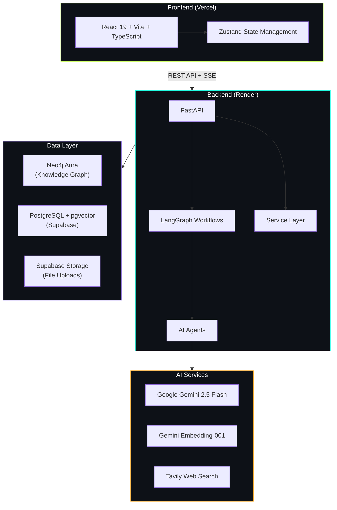
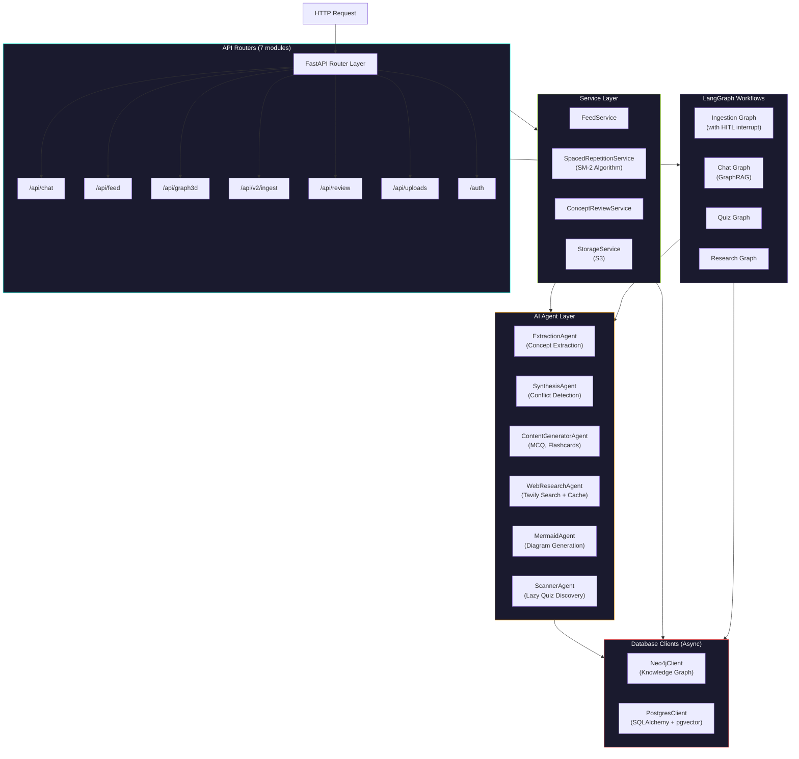
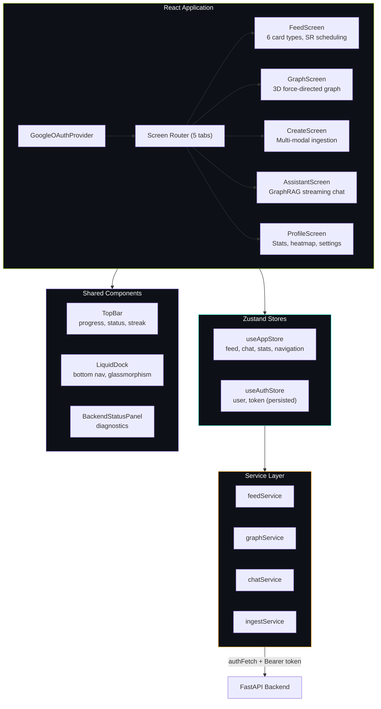
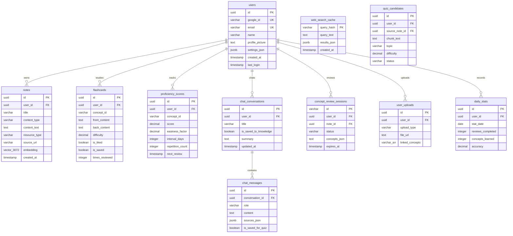
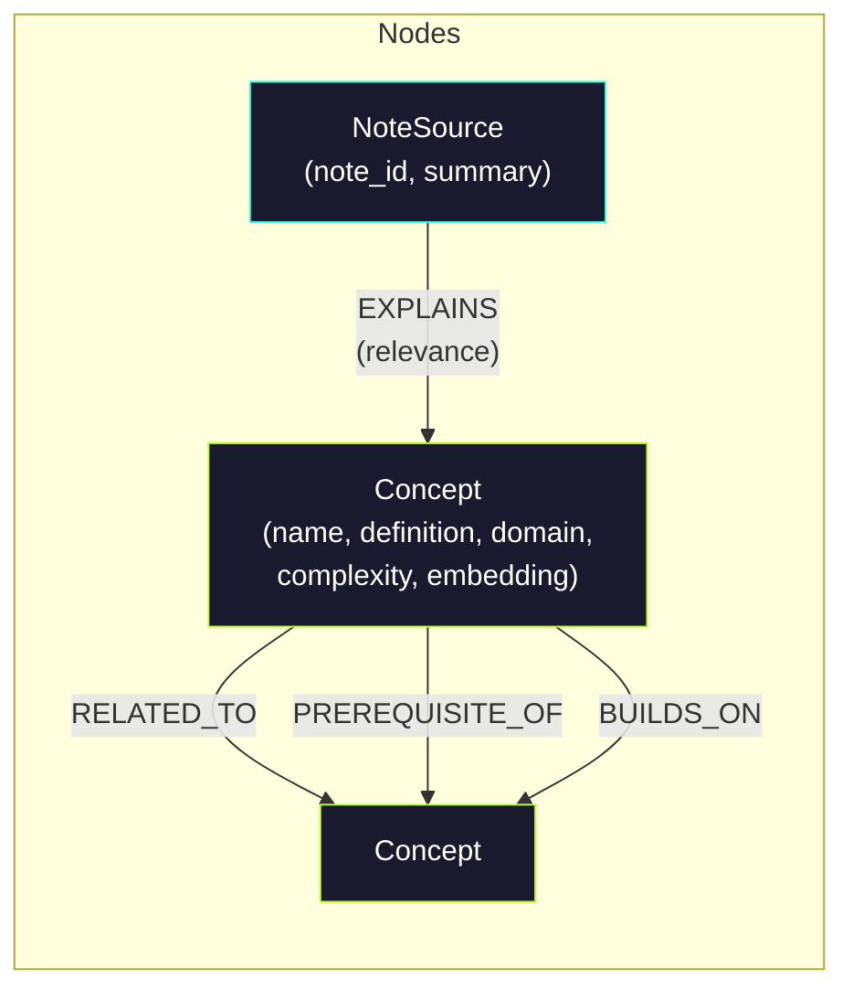
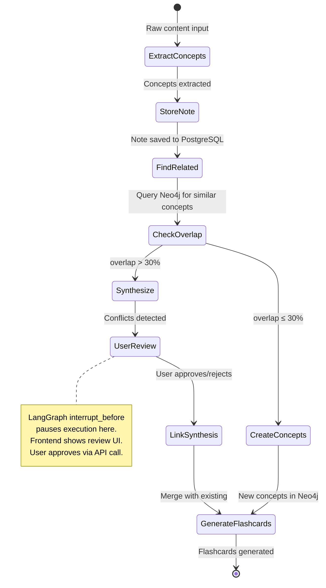
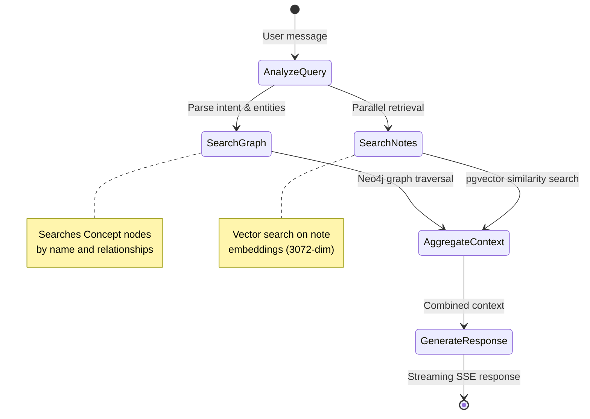

<div align="center">

# GraphRecall

### Lifetime Active Recall Learning System

**Transform your notes into an intelligent knowledge graph with AI-powered spaced repetition.**

[](https://fastapi.tiangolo.com)
[](https://react.dev)
[](https://langchain-ai.github.io/langgraph/)
[](https://neo4j.com)
[](https://www.postgresql.org)
[](https://www.typescriptlang.org)
[](LICENSE)

</div>

---

GraphRecall is a full-stack AI application that ingests your notes, articles, and transcripts, extracts key concepts into a **Neo4j knowledge graph**, and generates personalized study material using **spaced repetition (SM-2)**. A **GraphRAG chatbot** lets you query your knowledge base conversationally, while a **3D force-directed graph** visualizes how your concepts connect.

## Table of Contents

- [Features](#features)
- [Architecture Overview](#architecture-overview)
- [System Architecture](#system-architecture)
- [Tech Stack](#tech-stack)
- [Project Structure](#project-structure)
- [Getting Started](#getting-started)
- [Environment Variables](#environment-variables)
- [API Reference](#api-reference)
- [Database Schema](#database-schema)
- [LangGraph Workflows](#langgraph-workflows)
- [Frontend Screens](#frontend-screens)
- [Deployment](#deployment)
- [Development](#development)
- [License](#license)

---

## Features

### Knowledge Ingestion
- **Multi-format support** &mdash; Ingest markdown, plain text, PDF, images, DOCX, YouTube links, and LLM chat transcripts
- **URL scraping** &mdash; Fetch and process articles from Substack, Medium, blogs, and documentation sites
- **AI concept extraction** &mdash; Gemini 2.5 Flash extracts concepts with definitions, domains, complexity scores, and relationships
- **Duplicate & conflict detection** &mdash; Embedding-based synthesis detects overlapping, enhancing, or contradictory concepts
- **Human-in-the-loop review** &mdash; LangGraph `interrupt_before` lets you approve, edit, or reject concepts before they enter the graph

### Active Recall & Spaced Repetition
- **Six card types** &mdash; Flashcards, multiple-choice quizzes, fill-in-the-blank, screenshots, Mermaid diagrams, and concept showcases
- **SM-2 algorithm** &mdash; SuperMemo 2 scheduling adjusts review intervals based on your difficulty ratings
- **Topic-scoped quizzes** &mdash; Generate quizzes on any concept with automatic web research fallback via Tavily
- **Proficiency tracking** &mdash; Per-concept mastery scores drive adaptive feed ordering
- **Lazy Quiz Generation** &mdash; "Scanner Agent" identifies quiz candidates during ingestion, creating full questions only when needed (just-in-time) to save tokens.
- **Web Search Caching** &mdash; Intelligent caching of Tavily search results to reduce API costs and latency.


### Knowledge Graph
- **3D visualization** &mdash; Force-directed graph with zoom, pan, search, and focus modes
- **Domain clustering** &mdash; Concepts grouped and colored by subject area
- **Linked notes panel** &mdash; Click any node to see source notes and connected concepts
- **Graph-aware chat** &mdash; The chatbot traverses your graph to answer questions with context

### GraphRAG Assistant
- **Streaming responses** &mdash; Server-Sent Events for real-time chat
- **Dual retrieval** &mdash; Combines Neo4j graph traversal with PostgreSQL vector search (RAG)
- **Source citations** &mdash; Every response links back to the notes and concepts it used
- **Conversation persistence** &mdash; Full history with the ability to save conversations as new notes

---

## Architecture Overview



---

## System Architecture

### Backend Layered Architecture



### Frontend Architecture



---

## Tech Stack

| Layer | Technology |
|:------|:-----------|
| **Frontend** | React 19, TypeScript 5.9, Vite 7, Tailwind CSS 3.4 |
| **UI/UX** | Radix UI, Framer Motion, Three.js (3D graph), Recharts |
| **State** | Zustand 5 (persisted auth store) |
| **Backend** | Python 3.11+, FastAPI, Uvicorn |
| **AI Orchestration** | LangGraph 1.0+ (StateGraph with conditional edges, HITL interrupts) |
| **LLM** | Google Gemini 2.5 Flash (extraction, synthesis, content generation) |
| **Embeddings** | Gemini Embedding-001 (3072 dimensions) |
| **Knowledge Graph** | Neo4j Aura (Concept, NoteSource, Topic nodes) |
| **Relational DB** | PostgreSQL via Supabase (SQLAlchemy async + pgvector) |
| **Vector Search** | pgvector IVFFlat index on note embeddings |
| **File Storage** | Supabase Storage (S3-compatible) |
| **Web Research** | Tavily Search API (with PostgreSQL caching) |
| **Auth** | Google OAuth 2.0 |
| **Observability** | LangSmith tracing, structlog |
| **Deployment** | Render (backend), Vercel (frontend) |

---

## Project Structure

```
GraphRecall/
├── backend/
│   ├── agents/                    # AI agent implementations
│   │   ├── extraction.py          #   Concept extraction (Gemini)
│   │   ├── synthesis.py           #   Conflict/duplicate detection (embeddings + LLM)
│   │   ├── content_generator.py   #   MCQ, flashcard, fill-blank generation
│   │   ├── research_agent.py      #   Web research via Tavily
│   │   ├── mermaid_agent.py       #   Mermaid diagram generation
│   │   ├── scanner_agent.py       #   Lazy quiz candidate discovery
│   │   ├── web_quiz_agent.py      #   Web search with caching
│   │   └── states.py              #   Shared state schemas
│   ├── auth/
│   │   ├── google_oauth.py        #   Google token verification
│   │   └── middleware.py          #   Auth dependency (get_current_user)
│   ├── config/
│   │   └── llm.py                 #   LLM model configuration (cached)
│   ├── db/
│   │   ├── neo4j_client.py        #   Async Neo4j driver with pooling
│   │   ├── postgres_client.py     #   Async SQLAlchemy with pgvector
│   │   └── init.sql               #   PostgreSQL schema definitions
│   ├── graphs/                    # LangGraph state machines
│   │   ├── ingestion_graph.py     #   Note → concepts pipeline (HITL)
│   │   ├── chat_graph.py          #   GraphRAG conversation flow
│   │   ├── quiz_graph.py          #   Quiz generation with research
│   │   ├── article_graph.py       #   URL scraping + ingestion
│   │   ├── research_graph.py      #   Web research workflow
│   │   └── mermaid_graph.py       #   Diagram generation workflow
│   ├── models/
│   │   ├── schemas.py             #   Core Pydantic models
│   │   └── feed_schemas.py        #   Feed, stats, and card models
│   ├── prompts/
│   │   ├── extraction.txt         #   Concept extraction prompt
│   │   └── synthesis.txt          #   Conflict analysis prompt
│   ├── routers/
│   │   ├── chat.py                #   /api/chat — GraphRAG assistant
│   │   ├── feed.py                #   /api/feed — Active recall feed
│   │   ├── graph3d.py             #   /api/graph3d — 3D visualization
│   │   ├── ingest_v2.py           #   /api/v2 — LangGraph ingestion
│   │   ├── review.py              #   /api/review — Concept review (HITL)
│   │   ├── uploads.py             #   /api/uploads — File management
│   │   └── auth.py                #   /auth — Google OAuth
│   ├── services/
│   │   ├── feed_service.py        #   Feed generation & stats
│   │   ├── spaced_repetition.py   #   SM-2 algorithm implementation
│   │   ├── concept_review.py      #   HITL review session management
│   │   └── storage_service.py     #   S3-compatible file storage
│   ├── alembic/                   # Database migrations
│   ├── tests/                     # Test suite
│   └── main.py                    # FastAPI app entry point
│
├── frontend/
│   ├── src/
│   │   ├── screens/
│   │   │   ├── LoginScreen.tsx    #   Google OAuth sign-in
│   │   │   ├── FeedScreen.tsx     #   Active recall card feed
│   │   │   ├── GraphScreen.tsx    #   3D knowledge graph
│   │   │   ├── CreateScreen.tsx   #   Multi-modal content ingestion
│   │   │   ├── AssistantScreen.tsx #  GraphRAG streaming chatbot
│   │   │   └── ProfileScreen.tsx  #   Stats, heatmap, settings
│   │   ├── components/
│   │   │   ├── TopBar.tsx         #   Header with progress + status
│   │   │   ├── LiquidDock.tsx     #   Bottom nav (glassmorphism)
│   │   │   ├── BackendStatusPanel.tsx # Diagnostics sheet
│   │   │   └── ui/               #   Radix UI component library
│   │   ├── store/
│   │   │   ├── useAppStore.ts     #   App state (Zustand)
│   │   │   └── useAuthStore.ts    #   Auth state (persisted)
│   │   ├── services/
│   │   │   └── api.ts             #   API service layer
│   │   └── types/
│   │       └── index.ts           #   TypeScript definitions
│   ├── vite.config.ts
│   ├── tailwind.config.js
│   └── package.json
│
├── pyproject.toml                 # Python project config (uv/hatch)
├── requirements.txt               # Pip dependencies
├── render.yaml                    # Render deployment config
└── alembic.ini                    # Migration config
```

---

## Getting Started

### Prerequisites

| Requirement | Version |
|:------------|:--------|
| Python | 3.11+ |
| Node.js | 18+ |
| [uv](https://github.com/astral-sh/uv) | Latest (Python package manager) |
| Neo4j | 5.15+ (or [Neo4j Aura](https://neo4j.com/cloud/aura/) free tier) |
| PostgreSQL | 15+ with pgvector (or [Supabase](https://supabase.com) free tier) |

### 1. Clone the Repository

```bash
git clone https://github.com/usnaveen/GraphRecall.git
cd GraphRecall
```

### 2. Backend Setup

```bash
# Install Python dependencies
uv sync

# Copy and configure environment variables
cp .env.example .env
# Edit .env with your API keys (see Environment Variables section)

# Run database migrations
uv run alembic upgrade head

# Start the API server
uv run uvicorn backend.main:app --reload --port 8000
```

The API will be available at `http://localhost:8000` with interactive docs at `http://localhost:8000/docs`.

### 3. Frontend Setup

```bash
cd frontend

# Install dependencies
npm install

# Configure the API URL
echo "VITE_API_URL=http://localhost:8000/api" > .env
echo "VITE_GOOGLE_CLIENT_ID=your-google-client-id" >> .env

# Start the dev server
npm run dev
```

The app will be available at `http://localhost:5173`.

---

## Environment Variables

### Backend (`.env`)

| Variable | Required | Description |
|:---------|:--------:|:------------|
| `GOOGLE_API_KEY` | Yes | Google AI (Gemini) API key |
| `DATABASE_URL` | Yes | PostgreSQL connection string (with pgvector) |
| `NEO4J_URI` | Yes | Neo4j Bolt URI (e.g. `neo4j+s://xxx.databases.neo4j.io`) |
| `NEO4J_USER` | Yes | Neo4j username |
| `NEO4J_PASSWORD` | Yes | Neo4j password |
| `GOOGLE_CLIENT_ID` | Yes | Google OAuth 2.0 Client ID |
| `GOOGLE_CLIENT_SECRET` | Yes | Google OAuth 2.0 Client Secret |
| `SECRET_KEY` | Yes | JWT signing secret |
| `TAVILY_API_KEY` | No | Tavily API key (enables web research for quizzes) |
| `S3_BUCKET_NAME` | No | S3-compatible bucket for file uploads |
| `S3_ENDPOINT_URL` | No | S3 endpoint (Supabase Storage) |
| `S3_ACCESS_KEY_ID` | No | S3 access key |
| `S3_SECRET_ACCESS_KEY` | No | S3 secret key |
| `S3_PUBLIC_URL_BASE` | No | Public URL prefix for uploaded files |
| `LANGSMITH_API_KEY` | No | LangSmith API key (enables tracing) |
| `LANGSMITH_TRACING` | No | Set `true` to enable LangSmith tracing |
| `FRONTEND_URL` | No | Frontend URL for CORS (default: `http://localhost:5173`) |
| `ENVIRONMENT` | No | `production` enables PostgresSaver for LangGraph checkpoints |
| `DEBUG` | No | Set `true` for debug mode |

### Frontend (`.env`)

| Variable | Required | Description |
|:---------|:--------:|:------------|
| `VITE_API_URL` | Yes | Backend API base URL (e.g. `https://your-app.onrender.com/api`) |
| `VITE_GOOGLE_CLIENT_ID` | Yes | Google OAuth 2.0 Client ID |

---

## API Reference

### Authentication (`/auth`)

All endpoints (except `/auth/google` and `/health`) require a `Bearer` token in the `Authorization` header.

| Method | Endpoint | Description |
|:-------|:---------|:------------|
| `POST` | `/auth/google` | Exchange Google ID token for user session |
| `PATCH` | `/auth/profile` | Update user settings |

### Ingestion (`/api/v2`)

| Method | Endpoint | Description |
|:-------|:---------|:------------|
| `POST` | `/api/v2/ingest` | Ingest text/markdown with concept review |
| `POST` | `/api/v2/ingest/url` | Fetch and ingest an article URL |
| `POST` | `/api/v2/ingest/youtube` | Store a YouTube link |
| `POST` | `/api/v2/ingest/chat-transcript` | Process an LLM chat transcript |
| `GET` | `/api/v2/ingest/{thread_id}/status` | Check ingestion workflow status |
| `POST` | `/api/v2/ingest/{thread_id}/approve` | Approve/reject extracted concepts |

### Feed & Spaced Repetition (`/api/feed`)

| Method | Endpoint | Description |
|:-------|:---------|:------------|
| `GET` | `/api/feed` | Get personalized active recall feed |
| `POST` | `/api/feed/review` | Record difficulty rating (again/hard/good/easy) |
| `GET` | `/api/feed/stats` | User statistics (streak, accuracy, domains) |
| `GET` | `/api/feed/due-count` | Count of items due today |
| `POST` | `/api/feed/quiz/topic/{topic}` | Generate quiz on a specific topic |
| `GET` | `/api/feed/resources/{concept}` | Get all resources linked to a concept |
| `POST` | `/api/feed/{item_id}/like` | Toggle like on a card |
| `POST` | `/api/feed/{item_id}/save` | Toggle save on a card |

### Chat (`/api/chat`)

| Method | Endpoint | Description |
|:-------|:---------|:------------|
| `POST` | `/api/chat` | Send message to GraphRAG assistant |
| `POST` | `/api/chat/stream` | Stream response via SSE |
| `GET` | `/api/chat/suggestions` | Get contextual chat suggestions |
| `GET` | `/api/chat/history` | List recent conversations |
| `GET` | `/api/chat/conversations/{id}` | Get full conversation |
| `POST` | `/api/chat/conversations/{id}/messages` | Add message to conversation |
| `POST` | `/api/chat/messages/{id}/save` | Save message for quiz generation |
| `POST` | `/api/chat/conversations/{id}/to-knowledge` | Convert conversation to notes |
| `DELETE` | `/api/chat/conversations/{id}` | Delete conversation |

### Knowledge Graph (`/api/graph3d`)

| Method | Endpoint | Description |
|:-------|:---------|:------------|
| `GET` | `/api/graph3d` | Get full 3D graph data |
| `GET` | `/api/graph3d/focus/{concept_id}` | Get concept neighborhood with linked notes |
| `GET` | `/api/graph3d/domains` | List all domains with colors |
| `GET` | `/api/graph3d/search` | Search concepts for navigation |

### Concept Review (`/api/review`)

| Method | Endpoint | Description |
|:-------|:---------|:------------|
| `GET` | `/api/review/sessions` | List pending review sessions |
| `GET` | `/api/review/sessions/{id}` | Get session with concepts |
| `PUT` | `/api/review/sessions/{id}` | Edit concepts before approval |
| `POST` | `/api/review/sessions/{id}/approve` | Commit concepts to Neo4j |
| `POST` | `/api/review/sessions/{id}/cancel` | Cancel session |

### Uploads (`/api/uploads`)

| Method | Endpoint | Description |
|:-------|:---------|:------------|
| `POST` | `/api/uploads` | Upload screenshot/infographic |
| `GET` | `/api/uploads` | List user uploads |
| `GET` | `/api/uploads/{id}` | Get upload details |
| `POST` | `/api/uploads/{id}/link-concepts` | Link concepts to upload |
| `DELETE` | `/api/uploads/{id}` | Delete upload |

### Health

| Method | Endpoint | Description |
|:-------|:---------|:------------|
| `GET` | `/health` | System health (PostgreSQL + Neo4j status) |

---

## Database Schema

### PostgreSQL (Relational Data)



### Neo4j Knowledge Graph



**Node types:**
- **Concept** &mdash; A knowledge unit with name, definition, domain, complexity score, and vector embedding
- **NoteSource** &mdash; Links a PostgreSQL note to the concepts it explains (bridging relational and graph data)

**Relationship types:**
- `EXPLAINS` (NoteSource &rarr; Concept) &mdash; A note explains a concept, with relevance score
- `RELATED_TO` (Concept &harr; Concept) &mdash; Semantic relationship between concepts
- `PREREQUISITE_OF` (Concept &rarr; Concept) &mdash; Learning dependency
- `BUILDS_ON` (Concept &rarr; Concept) &mdash; Knowledge hierarchy

---

## LangGraph Workflows

### Ingestion Pipeline (Human-in-the-Loop)

The ingestion workflow uses LangGraph's `interrupt_before` for human review of extracted concepts.



### GraphRAG Chat Pipeline



---

## Frontend Screens

### Feed Screen
The primary study interface with six card types driven by SM-2 spaced repetition scheduling:

| Card Type | Description |
|:----------|:------------|
| **Flashcard** | Concept front/back with tap-to-flip, complexity badge, prerequisites |
| **Quiz (MCQ)** | Multiple choice with instant feedback and explanation |
| **Fill-in-Blank** | Interactive sentence completion with hints |
| **Screenshot** | User-uploaded images with linked concept badges |
| **Diagram** | Mermaid-generated visual mindmaps and flowcharts |
| **Concept Showcase** | Rich cards with emoji, tagline, real-world examples, and key points |

### Graph Screen
Interactive 3D force-directed knowledge graph with:
- Nodes sized by complexity, colored by mastery level
- Domain clustering and filtering
- Click-to-focus with linked notes panel and connected concepts
- In-graph quiz generation and resource browsing

### Create Screen
Multi-modal content ingestion with a step-by-step wizard:
1. **Upload** &mdash; Drag-and-drop files (PDF, DOCX, images, markdown) or paste text, YouTube URLs, chat transcripts
2. **Processing** &mdash; Real-time progress with geekout facts and concept previews
3. **Review** &mdash; Toggle concepts on/off, see which are new vs. existing (color-coded)
4. **Success** &mdash; Summary with stats and links to the feed

### Assistant Screen
GraphRAG chatbot with:
- Streaming responses via Server-Sent Events
- Quick actions (Search, Summarize, Quiz, Learning Path, Explain, Find Connections)
- Swipe-to-save messages for later review
- Source citations with links back to original notes
- Conversation history and knowledge base export

### Profile Screen
User dashboard with:
- GitHub-style 90-day activity heatmap
- Domain mastery progress bars
- Streak tracking with flame animation
- Notes and concepts browser with search
- Settings (theme, notifications, daily target)

---

## Deployment

### Backend on Render

The backend is configured via `render.yaml`:

```bash
# Service: graphrecall-api
# Runtime: Python
# Build: pip install -r requirements.txt
# Start: uvicorn backend.main:app --host 0.0.0.0 --port $PORT
# Health: /health
```

Set all required environment variables in the Render dashboard.

### Frontend on Vercel

The frontend deploys as a Vite SPA with `vercel.json` providing SPA rewrites:

```json
{
  "rewrites": [
    { "source": "/((?!assets/).*)", "destination": "/index.html" }
  ]
}
```

**Required Vercel environment variables:**
- `VITE_API_URL` &mdash; Your Render backend URL (e.g. `https://graphrecall-api.onrender.com/api`)
- `VITE_GOOGLE_CLIENT_ID` &mdash; Google OAuth Client ID

---

## Development

### Running Tests

```bash
# Backend tests
uv run pytest

# Type checking
uv run mypy backend/

# Linting
uv run ruff check backend/
```

### Frontend Development

```bash
cd frontend

# Dev server with hot reload
npm run dev

# Type check
npx tsc --noEmit

# Production build
npm run build
```

### Database Migrations

```bash
# Create a new migration
uv run alembic revision --autogenerate -m "description"

# Apply migrations
uv run alembic upgrade head

# Rollback one step
uv run alembic downgrade -1
```

### LangSmith Tracing

Enable tracing to debug LangGraph workflows:

```bash
export LANGSMITH_TRACING=true
export LANGSMITH_API_KEY=your-key
export LANGCHAIN_PROJECT=graphrecall
```

View traces at [smith.langchain.com](https://smith.langchain.com).

---

## License

This project is licensed under the MIT License. See [LICENSE](LICENSE) for details.

---

<div align="center">

Built with LangGraph, Gemini, Neo4j, and React

</div>
